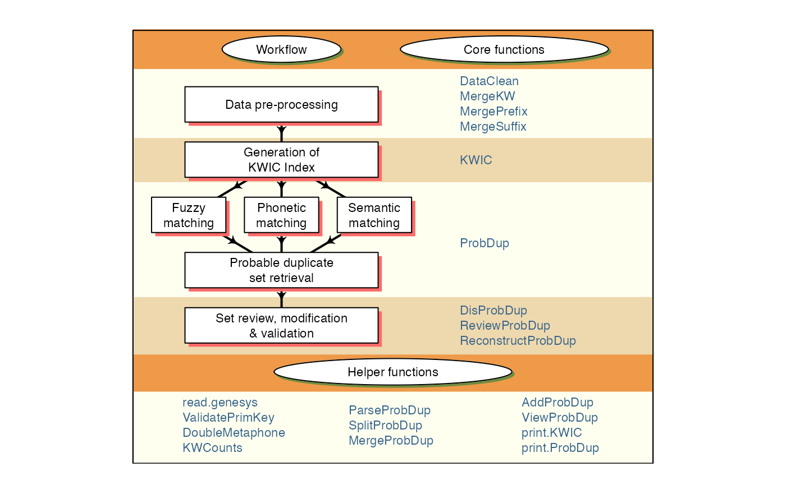
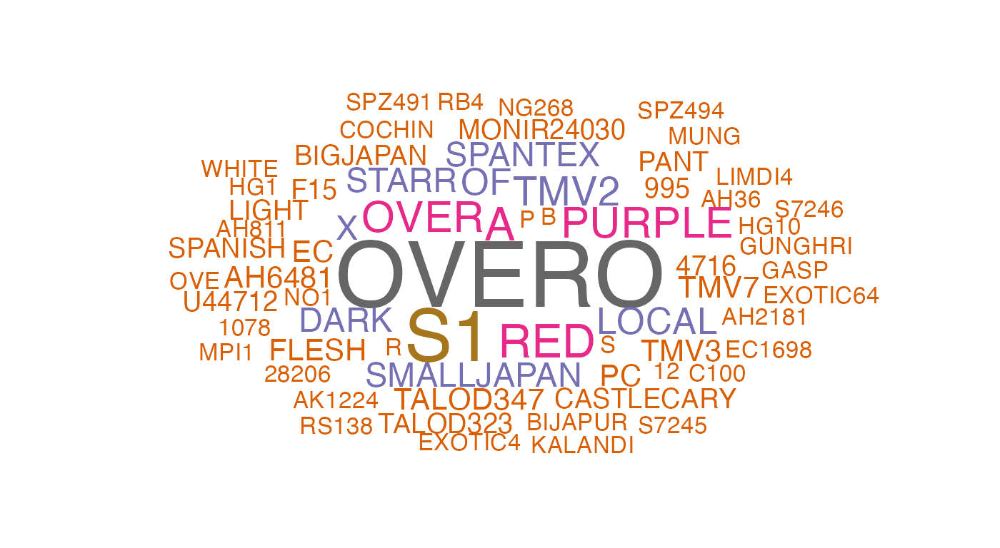
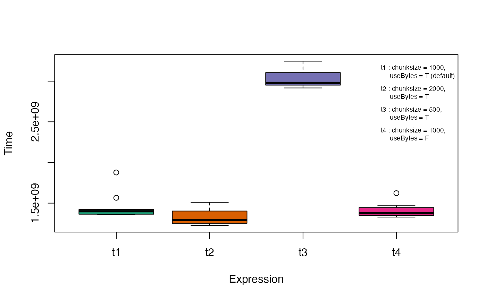
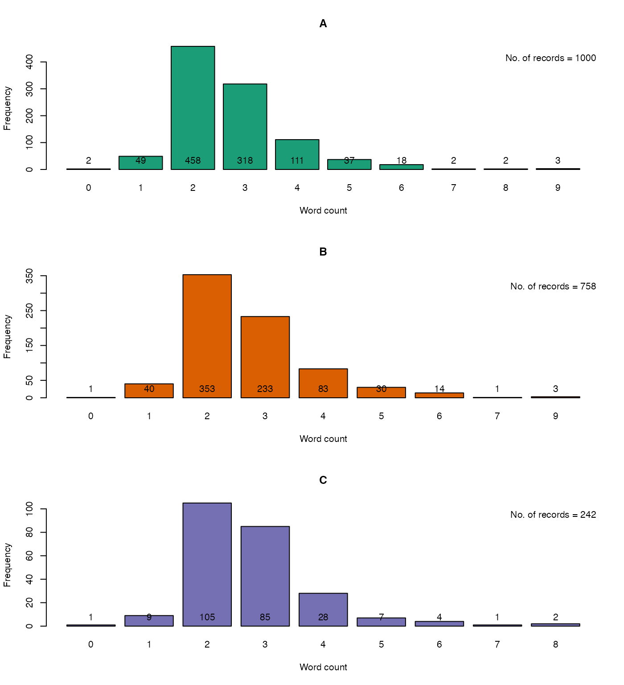

# An Introduction to \`PGRdup\` Package

1.  ICAR-National Bureau of Plant Genetic Resources, New Delhi, India.

&nbsp;

2.  Centre for Development of Advanced Computing, Thiruvananthapuram,
    Kerala, India.


## Introduction

**PGRdup** is an `R` package to facilitate the search for
probable/possible duplicate accessions in Plant Genetic Resources (PGR)
collections using passport databases. Primarily this package implements
a workflow (Fig. 1) designed to fetch groups or sets of germplasm
accessions with similar passport data particularly in fields associated
with accession names within or across PGR passport databases. It offers
a suite of functions for data pre-processing, creation of a searchable
Key Word in Context (KWIC) index of keywords associated with accession
records and the identification of probable duplicate sets by fuzzy,
phonetic and semantic matching of keywords. It also has functions to
enable the user to review, modify and validate the probable duplicate
sets retrieved.

The goal of this document is to introduce the users to these functions
and familiarise them with the workflow intended to fetch probable
duplicate sets. This document assumes a basic knowledge of `R`
programming language.

The functions in this package are primarily built using the `R` packages
[`data.table`](https://CRAN.R-project.org/package=data.table),
[`igraph`](https://CRAN.R-project.org/package=igraph),
[`stringdist`](https://CRAN.R-project.org/package=stringdist) and
[`stringi`](https://CRAN.R-project.org/package=stringi).




**Fig. 1.** PGRdup workflow and associated functions

## Version History

The current version of the package is 0.2.4.0. The previous versions are
as follows.

**Table 1.** Version history of `PGRdup` `R` package.

| Version | Date       |
|:--------|:-----------|
| 0.2     | 2015-04-14 |
| 0.2.1   | 2015-07-23 |
| 0.2.2   | 2016-03-05 |
| 0.2.2.1 | 2016-03-09 |
| 0.2.3   | 2017-02-01 |
| 0.2.3.1 | 2017-03-15 |
| 0.2.3.2 | 2017-08-05 |
| 0.2.3.3 | 2018-01-13 |
| 0.2.3.4 | 2019-09-19 |
| 0.2.3.5 | 2020-02-10 |
| 0.2.3.6 | 2020-07-27 |
| 0.2.3.7 | 2021-02-17 |
| 0.2.3.8 | 2023-05-23 |

To know detailed history of changes use `news(package='PGRdup')`.

## Installation

The package can be installed using the following functions:

``` r
# Install from CRAN
install.packages('PGRdup', dependencies=TRUE)
```

Uninstalled dependencies (packages which `PGRdup` depends on *viz*-
[`data.table`](https://CRAN.R-project.org/package=data.table),
[`igraph`](https://CRAN.R-project.org/package=igraph),
[`stringdist`](https://CRAN.R-project.org/package=stringdist) and
[`stringi`](https://CRAN.R-project.org/package=stringi) are also
installed because of the argument `dependencies=TRUE`.

Then the package can be loaded using the function

``` r
library(PGRdup)
```

## Data Format

The package is essentially designed to operate on PGR passport data
present in a [data frame
object](https://www.google.com/#q=%5BR%5D+data.frame), with each row
holding one record and columns representing the attribute fields. For
example, consider the dataset `GN1000` supplied along with the package.

``` r
library(PGRdup)
```

    --------------------------------------------------------------------------------
    Welcome to PGRdup version 0.2.4.0


    # To know how to use this package type:
      browseVignettes(package = 'PGRdup')
      for the package vignette.

    # To know whats new in this version type:
      news(package='PGRdup')
      for the NEWS file.

    # To cite the methods in the package type:
      citation(package='PGRdup')

    # To suppress this message use:
      suppressPackageStartupMessages(library(PGRdup))
    --------------------------------------------------------------------------------

``` r
# Load the dataset to the environment
data(GN1000)
# Show the class of the object
class(GN1000)
```

    [1] "data.frame"

``` r
# View the first few records in the data frame
head(GN1000)
```

      CommonName    BotanicalName NationalID                CollNo   DonorID
    1  Groundnut Arachis hypogaea   EC100277 Shulamith/ NRCG-14555  ICG-4709
    2  Groundnut Arachis hypogaea   EC100280                    NC   ICG5288
    3  Groundnut Arachis hypogaea   EC100281               MALIMBA   ICG5289
    4  Groundnut Arachis hypogaea   EC100713            EC 100713;   ICG5296
    5  Groundnut Arachis hypogaea   EC100715             EC 100715   ICG5298
    6  Groundnut Arachis hypogaea   EC100716                        ICG-3150
      OtherID1  OtherID2 BioStatus            SourceCountry TransferYear
    1           U4-47-12  Landrace                   Israel         2014
    2      NCS      NC 5  Landrace United States of America         2004
    3          EC 100281  Landrace                   Malawi         2004
    4              STARR  Landrace United States of America         2004
    5              COMET  Landrace United States of America         2004
    6          ARGENTINE  Landrace United States of America         2014

If the passport data exists as an excel sheet, it can be first converted
to a comma-separated values (csv) file or tab delimited file and then
easily imported into the `R` environment using the base functions
`read.csv` and `read.table` respectively. Similarly `read_csv()` and
`read_tsv()` from the
[`readr`](https://CRAN.R-project.org/package=readr) package can also be
used. Alternatively, the package
[`readxl`](https://CRAN.R-project.org/package=readxl) can be used to
directly read the data from excel. In case of large csv files, the
function `fread` in the
[`data.table`](https://CRAN.R-project.org/package=data.table) package
can be used to rapidly load the data.

If the PGR passport data is in a database management system (DBMS), the
required table can be imported as a data frame into `R`. using the
appropriate [`R`-database interface
package](https://www.burns-stat.com/r-database-interfaces/). For example
[`dbConnect`](https://CRAN.R-project.org/package=dbConnect) for MySQL,
[`ROracle`](https://CRAN.R-project.org/package=ROracle) for Oracle etc.

The PGR data downloaded from the
[genesys](https://www.genesys-pgr.org/welcome) database as a [Darwin
Core - Germplasm](https://github.com/dagendresen/darwincore-germplasm)
zip archive can be imported into the `R` environment as a flat file
`data.frame` using the `read.genesys` function.

``` r
# Import the DwC-Germplasm zip archive "genesys-accessions-filtered.zip"
PGRgenesys <- read.genesys("genesys-accessions-filtered.zip",
                           scrub.names.space = TRUE, readme = TRUE)
```

## Data Pre-processing

Data pre-processing is a critical step which can affect the quality of
the probable duplicate sets being retrieved. It involves data
standardization as well as data cleaning which can be achieved using the
functions `DataClean`, `MergeKW`, `MergePrefix` and `MergeSuffix`.

`DataClean` function can be used to clean the character strings in
passport data fields(columns) specified as the input [character
vector](https://www.google.com/#q=%5BR%5D+character+vector) `x`
according to the conditions specified in the arguments.

Commas, semicolons and colons which are sometimes used to separate
multiple strings or names within the same field can be replaced with a
single space using the logical arguments `fix.comma`, `fix.semcol` and
`fix.col` respectively.

``` r
x <- c("A 14; EC 1697", "U 4-4-28; EC 21078; A 32", "PI 262801:CIAT 9075:GKP 9553/90",
       "NCAC 16049, PI 261987, RCM 493-3")
x
```

    [1] "A 14; EC 1697"                    "U 4-4-28; EC 21078; A 32"        
    [3] "PI 262801:CIAT 9075:GKP 9553/90"  "NCAC 16049, PI 261987, RCM 493-3"

``` r
# Replace ',', ':' and ';' with space
DataClean(x, fix.comma=TRUE, fix.semcol=TRUE, fix.col=TRUE,
          fix.bracket=FALSE, fix.punct=FALSE, fix.space=FALSE, fix.sep=FALSE,
          fix.leadzero=FALSE)
```

    [1] "A 14  EC 1697"                    "U 4-4-28  EC 21078  A 32"        
    [3] "PI 262801 CIAT 9075 GKP 9553/90"  "NCAC 16049  PI 261987  RCM 493-3"

Similarly the logical argument `fix.bracket` can be used to replace all
brackets including parenthesis, square brackets and curly brackets with
space.

``` r
x <- c("(NRCG-1738)/(NFG649)", "26-5-1[NRCG-2528]", "Ah 1182 {NRCG-4340}")
x
```

    [1] "(NRCG-1738)/(NFG649)" "26-5-1[NRCG-2528]"    "Ah 1182 {NRCG-4340}" 

``` r
# Replace parenthesis, square brackets and curly brackets with space
DataClean(x, fix.comma=FALSE, fix.semcol=FALSE, fix.col=FALSE,
          fix.bracket=TRUE,
          fix.punct=FALSE, fix.space=FALSE, fix.sep=FALSE, fix.leadzero=FALSE)
```

    [1] "NRCG-1738 / NFG649" "26-5-1 NRCG-2528"   "AH 1182  NRCG-4340"

The logical argument `fix.punct` can be used to remove all punctuation
from the data.

``` r
x <- c("#26-6-3-1", "Culture No. 857", "U/4/47/13")
x
```

    [1] "#26-6-3-1"       "Culture No. 857" "U/4/47/13"      

``` r
# Remove punctuation
DataClean(x, fix.comma=FALSE, fix.semcol=FALSE, fix.col=FALSE, fix.bracket=FALSE,
          fix.punct=TRUE,
          fix.space=FALSE, fix.sep=FALSE, fix.leadzero=FALSE)
```

    [1] "26631"          "CULTURE NO 857" "U44713"        

`fix.space` can be used to convert all space characters such as tab,
newline, vertical tab, form feed and carriage return to spaces and
finally convert multiple spaces to single space.

``` r
x <- c("RS   1", "GKSPScGb 208  PI 475855")
x
```

    [1] "RS   1"                  "GKSPScGb 208  PI 475855"

``` r
# Replace all space characters to space and convert multiple spaces to single space
DataClean(x, fix.comma=FALSE, fix.semcol=FALSE, fix.col=FALSE,
          fix.bracket=FALSE, fix.punct=FALSE,
          fix.space=TRUE,
          fix.sep=FALSE, fix.leadzero=FALSE)
```

    [1] "RS 1"                   "GKSPSCGB 208 PI 475855"

`fix.sep` can be used to merge together accession identifiers composed
of alphabetic characters separated from a series of digits by a space
character.

``` r
x <- c("NCAC 18078", "AH 6481", "ICG 2791")
x
```

    [1] "NCAC 18078" "AH 6481"    "ICG 2791"  

``` r
# Merge alphabetic character separated from a series of digits by a space
DataClean(x, fix.comma=FALSE, fix.semcol=FALSE, fix.col=FALSE,
          fix.bracket=FALSE, fix.punct=FALSE, fix.space=FALSE,
          fix.sep=TRUE,
          fix.leadzero=FALSE)
```

    [1] "NCAC18078" "AH6481"    "ICG2791"  

`fix.leadzero` can be used to remove leading zeros from accession name
fields to facilitate matching to identify probable duplicates.

``` r
x <- c("EC 0016664", "EC0001690")
x
```

    [1] "EC 0016664" "EC0001690" 

``` r
# Remove leading zeros
DataClean(x, fix.comma=FALSE, fix.semcol=FALSE, fix.col=FALSE,
          fix.bracket=FALSE, fix.punct=FALSE, fix.space=FALSE, fix.sep=FALSE,
          fix.leadzero=TRUE)
```

    [1] "EC 16664" "EC1690"  

This function can hence be made use of in tidying up multiple forms of
messy data existing in fields associated with accession names in PGR
passport databases (Table 1).

``` r
names <- c("S7-12-6", "ICG-3505", "U 4-47-18;EC 21127", "AH 6481", "RS   1",
           "AK 12-24", "2-5 (NRCG-4053)", "T78, Mwitunde", "ICG 3410",
           "#648-4 (Gwalior)", "TG4;U/4/47/13", "EC0021003")
names
```

     [1] "S7-12-6"            "ICG-3505"           "U 4-47-18;EC 21127"
     [4] "AH 6481"            "RS   1"             "AK 12-24"          
     [7] "2-5 (NRCG-4053)"    "T78, Mwitunde"      "ICG 3410"          
    [10] "#648-4 (Gwalior)"   "TG4;U/4/47/13"      "EC0021003"         

``` r
# Clean the data
DataClean(names)
```

     [1] "S7126"          "ICG3505"        "U44718 EC21127" "AH6481"        
     [5] "RS1"            "AK1224"         "25 NRCG4053"    "T78 MWITUNDE"  
     [9] "ICG3410"        "6484 GWALIOR"   "TG4 U44713"     "EC21003"       

**Table 2.** Data pre-processing using `DataClean`.

| **names**          | **DataClean(names)** |
|:-------------------|:---------------------|
| S7-12-6            | S7126                |
| ICG-3505           | ICG3505              |
| U 4-47-18;EC 21127 | U44718 EC21127       |
| AH 6481            | AH6481               |
| RS 1               | RS1                  |
| AK 12-24           | AK1224               |
| 2-5 (NRCG-4053)    | 25 NRCG4053          |
| T78, Mwitunde      | T78 MWITUNDE         |
| ICG 3410           | ICG3410              |
| \#648-4 (Gwalior)  | 6484 GWALIOR         |
| TG4;U/4/47/13      | TG4 U44713           |
| EC0021003          | EC21003              |

Several common keyword string pairs or keyword prefixes and suffixes
exist in fields associated with accession names in PGR passport
databases. They can be merged using the functions `MergeKW`,
`MergePrefix` and `MergeSuffix` respectively. The keyword string pairs,
prefixes and suffixes can be supplied as a
[list](https://www.google.com/#q=%5BR%5D+list) or a
[vector](https://www.google.com/#q=%5BR%5D+vector) to the argument `y`
in these functions.

``` r
names <- c("Punjab Bold", "Gujarat- Dwarf", "Nagpur.local", "SAM COL 144",
           "SAM COL--280", "NIZAMABAD-LOCAL", "Dark Green Mutant",
           "Dixie-Giant", "Georgia- Bunch", "Uganda-erect", "Small Japan",
           "Castle  Cary", "Punjab erect", "Improved small japan",
           "Dark Purple")
names
```

     [1] "Punjab Bold"          "Gujarat- Dwarf"       "Nagpur.local"        
     [4] "SAM COL 144"          "SAM COL--280"         "NIZAMABAD-LOCAL"     
     [7] "Dark Green Mutant"    "Dixie-Giant"          "Georgia- Bunch"      
    [10] "Uganda-erect"         "Small Japan"          "Castle  Cary"        
    [13] "Punjab erect"         "Improved small japan" "Dark Purple"         

``` r
# Merge pairs of strings
y1 <- list(c("Gujarat", "Dwarf"), c("Castle", "Cary"), c("Small", "Japan"),
           c("Big", "Japan"), c("Mani", "Blanco"), c("Uganda", "Erect"),
           c("Mota", "Company"))
names <- MergeKW(names, y1, delim = c("space", "dash", "period"))

# Merge prefix strings
y2 <- c("Light", "Small", "Improved", "Punjab", "SAM", "Dark")
names <- MergePrefix(names, y2, delim = c("space", "dash", "period"))

# Merge suffix strings
y3 <- c("Local", "Bold", "Cary", "Mutant", "Runner", "Giant", "No.",
        "Bunch", "Peanut")
names <- MergeSuffix(names, y3, delim = c("space", "dash", "period"))

names
```

     [1] "PunjabBold"         "GujaratDwarf"       "Nagpurlocal"       
     [4] "SAMCOL 144"         "SAMCOL--280"        "NIZAMABADLOCAL"    
     [7] "DarkGreenMutant"    "DixieGiant"         "GeorgiaBunch"      
    [10] "Ugandaerect"        "SmallJapan"         "CastleCary"        
    [13] "Punjaberect"        "Improvedsmalljapan" "DarkPurple"        

These functions can be applied over multiple columns(fields) in a data
frame using the [`lapply`](https://www.google.com/#q=%5BR%5D+lapply)
function.

``` r
# Load example dataset
GN <- GN1000

# Specify as a vector the database fields to be used
GNfields <- c("NationalID", "CollNo", "DonorID", "OtherID1", "OtherID2")
head(GN[GNfields])
```

      NationalID                CollNo   DonorID OtherID1  OtherID2
    1   EC100277 Shulamith/ NRCG-14555  ICG-4709           U4-47-12
    2   EC100280                    NC   ICG5288      NCS      NC 5
    3   EC100281               MALIMBA   ICG5289          EC 100281
    4   EC100713            EC 100713;   ICG5296              STARR
    5   EC100715             EC 100715   ICG5298              COMET
    6   EC100716                        ICG-3150          ARGENTINE

``` r
# Clean the data
GN[GNfields] <- lapply(GN[GNfields], function(x) DataClean(x))
y1 <- list(c("Gujarat", "Dwarf"), c("Castle", "Cary"), c("Small", "Japan"),
c("Big", "Japan"), c("Mani", "Blanco"), c("Uganda", "Erect"),
c("Mota", "Company"))
y2 <- c("Dark", "Light", "Small", "Improved", "Punjab", "SAM")
y3 <- c("Local", "Bold", "Cary", "Mutant", "Runner", "Giant", "No.",
        "Bunch", "Peanut")
GN[GNfields] <- lapply(GN[GNfields],
                       function(x) MergeKW(x, y1, delim = c("space", "dash")))
GN[GNfields] <- lapply(GN[GNfields],
                       function(x) MergePrefix(x, y2, delim = c("space", "dash")))
GN[GNfields] <- lapply(GN[GNfields],
                       function(x) MergeSuffix(x, y3, delim = c("space", "dash")))
head(GN[GNfields])
```

      NationalID              CollNo DonorID OtherID1  OtherID2
    1   EC100277 SHULAMITH NRCG14555 ICG4709             U44712
    2   EC100280                  NC ICG5288      NCS       NC5
    3   EC100281             MALIMBA ICG5289           EC100281
    4   EC100713            EC100713 ICG5296              STARR
    5   EC100715            EC100715 ICG5298              COMET
    6   EC100716                     ICG3150          ARGENTINE

## Generation of KWIC Index

The function `KWIC` generates a Key Word in Context index ([Knüpffer
1988](#ref-knupffer1988european); [Knüpffer, Frese, and Jongen
1997](#ref-kfj97)) from the data frame of a PGR passport database based
on the fields(columns) specified in the argument `fields` along with the
keyword frequencies and gives the output as a list of class `KWIC`. The
first element of the vector specified in `fields` is considered as the
primary key or identifier which uniquely identifies all rows in the data
frame.

This function fetches keywords from different fields specified, which
can be subsequently used for matching to identify probable duplicates.
The frequencies of the keywords retrieved can help in determining if
further data pre-processing is required and also to decide whether any
common keywords can be exempted from matching (Fig. 2).

``` r
# Load example dataset
GN <- GN1000

# Specify as a vector the database fields to be used
GNfields <- c("NationalID", "CollNo", "DonorID", "OtherID1", "OtherID2")

# Clean the data
GN[GNfields] <- lapply(GN[GNfields], function(x) DataClean(x))
y1 <- list(c("Gujarat", "Dwarf"), c("Castle", "Cary"), c("Small", "Japan"),
c("Big", "Japan"), c("Mani", "Blanco"), c("Uganda", "Erect"),
c("Mota", "Company"))
y2 <- c("Dark", "Light", "Small", "Improved", "Punjab", "SAM")
y3 <- c("Local", "Bold", "Cary", "Mutant", "Runner", "Giant", "No.",
        "Bunch", "Peanut")
GN[GNfields] <- lapply(GN[GNfields],
                       function(x) MergeKW(x, y1, delim = c("space", "dash")))
GN[GNfields] <- lapply(GN[GNfields],
                       function(x) MergePrefix(x, y2, delim = c("space", "dash")))
GN[GNfields] <- lapply(GN[GNfields],
                       function(x) MergeSuffix(x, y3, delim = c("space", "dash")))

# Generate the KWIC index
GNKWIC <- KWIC(GN, GNfields, min.freq = 1)
class(GNKWIC)
```

    [1] "KWIC"

``` r
GNKWIC
```

    KWIC fields : NationalID CollNo DonorID OtherID1 OtherID2
    Number of keywords : 3893
    Number of distinct keywords : 3109

``` r
# Retrieve the KWIC index from the KWIC object
KWIC <- GNKWIC[[1]]
KWIC <- KWIC[order(KWIC$KEYWORD, decreasing = TRUE),]
head(KWIC[,c("PRIM_ID", "KWIC_L", "KWIC_KW", "KWIC_R")], n = 10)
```

          PRIM_ID                                     KWIC_L  KWIC_KW
    550  EC490380            EC490380 =  = ICG1122 =  = LIN      YUCH
    435   EC36893                                 EC36893 =      YUAN
    434   EC36893                            EC36893 = YUAN     YOUNG
    1287 EC613524       EC613524 = NRCG9225 =  = PEI KANGPE    YOUDON
    1703 IC113088                       IC113088 =  =  = SB        XI
    1741 IC296965 IC296965 = SB X11 X V11 = ICG1769 =  = SB        XI
    3385 IC445197                                IC445197 =   X144B28
    3483 IC494754                IC494754 =  = ICG7686 =  =   X144B28
    2090 IC304018    IC304018 = 144B19B NRCG = ICG1561 =  =  X144B19B
    1735 IC296965                             IC296965 = SB       X11
                                    KWIC_R
    550                               TSAO
    435   YOUNG TOU = ICG5241 =  = EC36893
    434         TOU = ICG5241 =  = EC36893
    1287                                 =
    1703                        = IC305003
    1741                             X VII
    3385           B = ICG2113 =  = LIMDI4
    3483                                 B
    2090                                  
    1735  X V11 = ICG1769 =  = SB XI X VII

``` r
# Retrieve the keyword frequencies from the KWIC object
KeywordFreq <- GNKWIC[[2]]
head(KeywordFreq)
```

      Keyword Freq
    1   OVERO   25
    2      S1   19
    3       A   11
    4     RED   11
    5    OVER   10
    6  PURPLE   10



**Fig. 2.** Word cloud of keywords retrieved

The function will throw an error in case of duplicates or NULL values in
the primary key/ID field mentioned.

``` r
GN <- GN1000
GN[GNfields] <- lapply(GN[GNfields], function(x) DataClean(x))
# Generate dummy duplicates for illustration
GN[1001:1005,] <- GN[1:5,]
# Generate dummy NULL values for illustration
GN[1001,3] <- ""
GN[1002,3] <- ""
GN[1001:1005,]
```

         CommonName    BotanicalName NationalID              CollNo DonorID
    1001  Groundnut Arachis hypogaea            SHULAMITH NRCG14555 ICG4709
    1002  Groundnut Arachis hypogaea                             NC ICG5288
    1003  Groundnut Arachis hypogaea   EC100281             MALIMBA ICG5289
    1004  Groundnut Arachis hypogaea   EC100713            EC100713 ICG5296
    1005  Groundnut Arachis hypogaea   EC100715            EC100715 ICG5298
         OtherID1 OtherID2 BioStatus            SourceCountry TransferYear
    1001            U44712  Landrace                   Israel         2014
    1002      NCS      NC5  Landrace United States of America         2004
    1003          EC100281  Landrace                   Malawi         2004
    1004             STARR  Landrace United States of America         2004
    1005             COMET  Landrace United States of America         2004

``` r
GNKWIC <- KWIC(GN, GNfields, min.freq=1)
```

    Error in KWIC(GN, GNfields, min.freq = 1) :
      Primary key/ID field should be unique and not NULL
     Use PGRdup::ValidatePrimKey() to identify and rectify the aberrant records first

The erroneous records can be identified using the helper function
`ValidatePrimKey`.

``` r
# Validate the primary key/ID field for duplication or existence of NULL values
ValidatePrimKey(x = GN, prim.key = "NationalID")
```

    $message1
    [1] "ERROR: Duplicated records found in prim.key field"

    $Duplicates
         CommonName    BotanicalName NationalID              CollNo DonorID
    1001  Groundnut Arachis hypogaea            SHULAMITH NRCG14555 ICG4709
    1002  Groundnut Arachis hypogaea                             NC ICG5288
    3     Groundnut Arachis hypogaea   EC100281             MALIMBA ICG5289
    1003  Groundnut Arachis hypogaea   EC100281             MALIMBA ICG5289
    4     Groundnut Arachis hypogaea   EC100713            EC100713 ICG5296
    1004  Groundnut Arachis hypogaea   EC100713            EC100713 ICG5296
    5     Groundnut Arachis hypogaea   EC100715            EC100715 ICG5298
    1005  Groundnut Arachis hypogaea   EC100715            EC100715 ICG5298
         OtherID1 OtherID2 BioStatus            SourceCountry TransferYear
    1001            U44712  Landrace                   Israel         2014
    1002      NCS      NC5  Landrace United States of America         2004
    3             EC100281  Landrace                   Malawi         2004
    1003          EC100281  Landrace                   Malawi         2004
    4                STARR  Landrace United States of America         2004
    1004             STARR  Landrace United States of America         2004
    5                COMET  Landrace United States of America         2004
    1005             COMET  Landrace United States of America         2004

    $message2
    [1] "ERROR: NULL records found in prim.key field"

    $NullRecords
         CommonName    BotanicalName NationalID              CollNo DonorID
    1001  Groundnut Arachis hypogaea            SHULAMITH NRCG14555 ICG4709
    1002  Groundnut Arachis hypogaea                             NC ICG5288
         OtherID1 OtherID2 BioStatus            SourceCountry TransferYear primdup
    1001            U44712  Landrace                   Israel         2014    TRUE
    1002      NCS      NC5  Landrace United States of America         2004    TRUE

``` r
# Remove the offending records
GN <- GN[-c(1001:1005), ]
# Validate again
ValidatePrimKey(x = GN, prim.key = "NationalID")
```

    $message1
    [1] "OK: No duplicated records found in prim.key field"

    $Duplicates
    NULL

    $message2
    [1] "OK: No NULL records found in prim.key field"

    $NullRecords
    NULL

## Retrieval of Probable Duplicate Sets

Once KWIC indexes are generated, probable duplicates of germplasm
accessions can be identified by fuzzy, phonetic and semantic matching of
the associated keywords using the function `ProbDup`. The sets are
retrieved as a list of data frames of class `ProbDup`.

Keywords that are not to be used for matching can be specified as a
vector in the `excep` argument.

### Methods

The function can execute matching according to either one of the
following three methods as specified by the `method` argument.

1.  **Method `"a"`** : Performs string matching of keywords in a single
    KWIC index to identify probable duplicates of accessions in a single
    PGR passport database.

``` r
# Load example dataset
GN <- GN1000

# Specify as a vector the database fields to be used
GNfields <- c("NationalID", "CollNo", "DonorID", "OtherID1", "OtherID2")

# Clean the data
GN[GNfields] <- lapply(GN[GNfields], function(x) DataClean(x))
y1 <- list(c("Gujarat", "Dwarf"), c("Castle", "Cary"), c("Small", "Japan"),
c("Big", "Japan"), c("Mani", "Blanco"), c("Uganda", "Erect"),
c("Mota", "Company"))
y2 <- c("Dark", "Light", "Small", "Improved", "Punjab", "SAM")
y3 <- c("Local", "Bold", "Cary", "Mutant", "Runner", "Giant", "No.",
        "Bunch", "Peanut")
GN[GNfields] <- lapply(GN[GNfields],
                       function(x) MergeKW(x, y1, delim = c("space", "dash")))
GN[GNfields] <- lapply(GN[GNfields],
                       function(x) MergePrefix(x, y2, delim = c("space", "dash")))
GN[GNfields] <- lapply(GN[GNfields],
                       function(x) MergeSuffix(x, y3, delim = c("space", "dash")))

# Generate the KWIC index
GNKWIC <- KWIC(GN, GNfields)
```

``` r
# Specify the exceptions as a vector
exep <- c("A", "B", "BIG", "BOLD", "BUNCH", "C", "COMPANY", "CULTURE",
         "DARK", "E", "EARLY", "EC", "ERECT", "EXOTIC", "FLESH", "GROUNDNUT",
         "GUTHUKAI", "IMPROVED", "K", "KUTHUKADAL", "KUTHUKAI", "LARGE",
         "LIGHT", "LOCAL", "OF", "OVERO", "P", "PEANUT", "PURPLE", "R",
         "RED", "RUNNER", "S1", "SAM", "SMALL", "SPANISH", "TAN", "TYPE",
         "U", "VALENCIA", "VIRGINIA", "WHITE")

# Fetch fuzzy duplicates by method 'a'
GNdup <- ProbDup(kwic1 = GNKWIC, method = "a", excep = exep, fuzzy = TRUE,
                 phonetic = FALSE, semantic = FALSE)
```

    Fuzzy matching

      |                                                                              |==================                                                    |  25%Block 1 / 4 |  |                                                                              |===================================                                   |  50%Block 2 / 4 |  |                                                                              |====================================================                  |  75%Block 3 / 4 |  |                                                                              |======================================================================| 100%Block 4 / 4 |

``` r
class(GNdup)
```

    [1] "ProbDup"

``` r
GNdup
```

    Method : a

    KWIC1 fields : NationalID CollNo DonorID OtherID1 OtherID2
     
                    No..of.Sets    No..of.Records
    FuzzyDuplicates         378               745
    Total                   378 745(Distinct:745)

``` r
# Fetch phonetic duplicates by method 'a'
GNdup <- ProbDup(kwic1 = GNKWIC, method = "a", excep = exep, fuzzy = FALSE,
                 phonetic = TRUE, semantic = FALSE)
```

    Phonetic matching

      |                                                                              |==================                                                    |  25%Block 1 / 4 |  |                                                                              |===================================                                   |  50%Block 2 / 4 |  |                                                                              |====================================================                  |  75%Block 3 / 4 |  |                                                                              |======================================================================| 100%Block 4 / 4 |

``` r
class(GNdup)
```

    [1] "ProbDup"

``` r
GNdup
```

    Method : a

    KWIC1 fields : NationalID CollNo DonorID OtherID1 OtherID2
     
                       No..of.Sets    No..of.Records
    PhoneticDuplicates          99               260
    Total                       99 260(Distinct:260)

2.  **Method `"b"`** : Performs string matching of keywords in the first
    KWIC index (query) with that of the keywords in the second index
    (source) to identify probable duplicates of accessions of the first
    PGR passport database among the accessions in the second database.

3.  **Method `"c"`** : Performs string matching of keywords in two
    different KWIC indexes jointly to identify probable duplicates of
    accessions from among two PGR passport databases.

``` r
# Load PGR passport databases
GN1 <- GN1000[!grepl("^ICG", GN1000$DonorID), ]
GN1$DonorID <- NULL
GN2 <- GN1000[grepl("^ICG", GN1000$DonorID), ]
GN2$NationalID <- NULL

# Specify database fields to use
GN1fields <- c("NationalID", "CollNo", "OtherID1", "OtherID2")
GN2fields <- c("DonorID", "CollNo", "OtherID1", "OtherID2")

# Clean the data
GN1[GN1fields] <- lapply(GN1[GN1fields], function(x) DataClean(x))
GN2[GN2fields] <- lapply(GN2[GN2fields], function(x) DataClean(x))
y1 <- list(c("Gujarat", "Dwarf"), c("Castle", "Cary"), c("Small", "Japan"),
c("Big", "Japan"), c("Mani", "Blanco"), c("Uganda", "Erect"),
c("Mota", "Company"))
y2 <- c("Dark", "Light", "Small", "Improved", "Punjab", "SAM")
y3 <- c("Local", "Bold", "Cary", "Mutant", "Runner", "Giant", "No.",
        "Bunch", "Peanut")
GN1[GN1fields] <- lapply(GN1[GN1fields],
                         function(x) MergeKW(x, y1, delim = c("space", "dash")))
GN1[GN1fields] <- lapply(GN1[GN1fields],
                         function(x) MergePrefix(x, y2, delim = c("space", "dash")))
GN1[GN1fields] <- lapply(GN1[GN1fields],
                         function(x) MergeSuffix(x, y3, delim = c("space", "dash")))
GN2[GN2fields] <- lapply(GN2[GN2fields],
                         function(x) MergeKW(x, y1, delim = c("space", "dash")))
GN2[GN2fields] <- lapply(GN2[GN2fields],
                         function(x) MergePrefix(x, y2, delim = c("space", "dash")))
GN2[GN2fields] <- lapply(GN2[GN2fields],
                         function(x) MergeSuffix(x, y3, delim = c("space", "dash")))

# Remove duplicated DonorID records in GN2
GN2 <- GN2[!duplicated(GN2$DonorID), ]

# Generate KWIC index
GN1KWIC <- KWIC(GN1, GN1fields)
GN2KWIC <- KWIC(GN2, GN2fields)

# Specify the exceptions as a vector
exep <- c("A", "B", "BIG", "BOLD", "BUNCH", "C", "COMPANY", "CULTURE",
         "DARK", "E", "EARLY", "EC", "ERECT", "EXOTIC", "FLESH", "GROUNDNUT",
         "GUTHUKAI", "IMPROVED", "K", "KUTHUKADAL", "KUTHUKAI", "LARGE",
         "LIGHT", "LOCAL", "OF", "OVERO", "P", "PEANUT", "PURPLE", "R",
         "RED", "RUNNER", "S1", "SAM", "SMALL", "SPANISH", "TAN", "TYPE",
         "U", "VALENCIA", "VIRGINIA", "WHITE")

# Fetch fuzzy and phonetic duplicate sets by method b
GNdupb <- ProbDup(kwic1 = GN1KWIC, kwic2 = GN2KWIC, method = "b",
                  excep = exep, fuzzy = TRUE, phonetic = TRUE,
                  encoding = "primary", semantic = FALSE)
```

    Fuzzy matching

      |                                                                              |======================================================================| 100%Block 1 / 1 |

    Phonetic matching

      |                                                                              |======================================================================| 100%Block 1 / 1 |

``` r
class(GNdupb)
```

    [1] "ProbDup"

``` r
GNdupb
```

    Method : b

    KWIC1 fields : NationalID CollNo OtherID1 OtherID2

    KWIC2 fields : DonorID CollNo OtherID1 OtherID2
     
                       No..of.Sets    No..of.Records
    FuzzyDuplicates            107               353
    PhoneticDuplicates          41               126
    Total                      148 479(Distinct:383)

``` r
# Fetch fuzzy and phonetic duplicate sets by method c
GNdupc <- ProbDup(kwic1 = GN1KWIC, kwic2 = GN2KWIC, method = "c",
                  excep = exep, fuzzy = TRUE, phonetic = TRUE,
                  encoding = "primary", semantic = FALSE)
```

    Fuzzy matching

      |                                                                              |=======================                                               |  33%Block 1 / 3 |  |                                                                              |===============================================                       |  67%Block 2 / 3 |  |                                                                              |======================================================================| 100%Block 3 / 3 |

    Phonetic matching

      |                                                                              |=======================                                               |  33%Block 1 / 3 |  |                                                                              |===============================================                       |  67%Block 2 / 3 |  |                                                                              |======================================================================| 100%Block 3 / 3 |

``` r
class(GNdupc)
```

    [1] "ProbDup"

``` r
GNdupc
```

    Method : c

    KWIC1 fields : NationalID CollNo OtherID1 OtherID2

    KWIC2 fields : DonorID CollNo OtherID1 OtherID2
     
                       No..of.Sets    No..of.Records
    FuzzyDuplicates            363               724
    PhoneticDuplicates          98               257
    Total                      461 981(Distinct:741)

### Matching Strategies

1.  **Fuzzy matching** or approximate string matching of keywords is
    carried out by computing the [generalized levenshtein (edit)
    distance](https://en.wikipedia.org/wiki/Levenshtein_distance)
    between them. This distance measure counts the number of deletions,
    insertions and substitutions necessary to turn one string to
    another.

``` r
# Load example dataset
GN <- GN1000

# Specify as a vector the database fields to be used
GNfields <- c("NationalID", "CollNo", "DonorID", "OtherID1", "OtherID2")

# Clean the data
GN[GNfields] <- lapply(GN[GNfields], function(x) DataClean(x))
y1 <- list(c("Gujarat", "Dwarf"), c("Castle", "Cary"), c("Small", "Japan"),
c("Big", "Japan"), c("Mani", "Blanco"), c("Uganda", "Erect"),
c("Mota", "Company"))
y2 <- c("Dark", "Light", "Small", "Improved", "Punjab", "SAM")
y3 <- c("Local", "Bold", "Cary", "Mutant", "Runner", "Giant", "No.",
        "Bunch", "Peanut")
GN[GNfields] <- lapply(GN[GNfields],
                       function(x) MergeKW(x, y1, delim = c("space", "dash")))
GN[GNfields] <- lapply(GN[GNfields],
                       function(x) MergePrefix(x, y2, delim = c("space", "dash")))
GN[GNfields] <- lapply(GN[GNfields],
                       function(x) MergeSuffix(x, y3, delim = c("space", "dash")))

# Generate the KWIC index
GNKWIC <- KWIC(GN, GNfields)

# Specify the exceptions as a vector
exep <- c("A", "B", "BIG", "BOLD", "BUNCH", "C", "COMPANY", "CULTURE",
         "DARK", "E", "EARLY", "EC", "ERECT", "EXOTIC", "FLESH", "GROUNDNUT",
         "GUTHUKAI", "IMPROVED", "K", "KUTHUKADAL", "KUTHUKAI", "LARGE",
         "LIGHT", "LOCAL", "OF", "OVERO", "P", "PEANUT", "PURPLE", "R",
         "RED", "RUNNER", "S1", "SAM", "SMALL", "SPANISH", "TAN", "TYPE",
         "U", "VALENCIA", "VIRGINIA", "WHITE")

# Fetch fuzzy duplicates
GNdup <- ProbDup(kwic1 = GNKWIC, method = "a", excep = exep, 
                 fuzzy = TRUE, max.dist = 3,
                 phonetic = FALSE, semantic = FALSE)
```

    Fuzzy matching

      |                                                                              |==================                                                    |  25%Block 1 / 4 |  |                                                                              |===================================                                   |  50%Block 2 / 4 |  |                                                                              |====================================================                  |  75%Block 3 / 4 |  |                                                                              |======================================================================| 100%Block 4 / 4 |

``` r
GNdup
```

    Method : a

    KWIC1 fields : NationalID CollNo DonorID OtherID1 OtherID2
     
                    No..of.Sets    No..of.Records
    FuzzyDuplicates         378               745
    Total                   378 745(Distinct:745)

The maximum distance to be considered for a match can be specified by
`max.dist` argument.

``` r
GNdup <- ProbDup(kwic1 = GNKWIC, method = "a", excep = exep, 
                 fuzzy = TRUE, max.dist = 1,
                 phonetic = FALSE, semantic = FALSE)
```

    Fuzzy matching

      |                                                                              |==================                                                    |  25%Block 1 / 4 |  |                                                                              |===================================                                   |  50%Block 2 / 4 |  |                                                                              |====================================================                  |  75%Block 3 / 4 |  |                                                                              |======================================================================| 100%Block 4 / 4 |

``` r
GNdup
```

    Method : a

    KWIC1 fields : NationalID CollNo DonorID OtherID1 OtherID2
     
                    No..of.Sets    No..of.Records
    FuzzyDuplicates         288               679
    Total                   288 679(Distinct:679)

Exact matching can be enforced with the argument `force.exact` set as
TRUE. It can be used to avoid fuzzy matching when the number of alphabet
characters in keywords is lesser than a critical value (`max.alpha`).
Similarly, the value of `max.digit` can also be set according to the
requirements to enforce exact matching. The default value of `Inf`
avoids fuzzy matching and enforces exact matching for all keywords
having any numerical characters. If `max.digit` and `max.alpha` are both
set to `Inf`, exact matching will be enforced for all the keywords.

When exact matching is enforced, for keywords having both alphabet and
numeric characters and with the number of alphabet characters greater
than `max.digit`, matching will be carried out separately for alphabet
and numeric characters present.

``` r
GNdup <- ProbDup(kwic1 = GNKWIC, method = "a", excep = exep, 
                 fuzzy = TRUE, force.exact = TRUE, max.alpha = 4, max.digit = Inf,
                 phonetic = FALSE, semantic = FALSE)
```

    Fuzzy matching

      |                                                                              |==================                                                    |  25%Block 1 / 4 |  |                                                                              |===================================                                   |  50%Block 2 / 4 |  |                                                                              |====================================================                  |  75%Block 3 / 4 |  |                                                                              |======================================================================| 100%Block 4 / 4 |

``` r
GNdup
```

    Method : a

    KWIC1 fields : NationalID CollNo DonorID OtherID1 OtherID2
     
                    No..of.Sets    No..of.Records
    FuzzyDuplicates         378               745
    Total                   378 745(Distinct:745)

2.  **Phonetic matching** of keywords is carried out using the Double
    Metaphone phonetic algorithm which is implemented as the helper
    function `DoubleMetaphone`, ([Philips 2000](#ref-p00)), to identify
    keywords that have the similar pronunciation.

``` r
GNdup <- ProbDup(kwic1 = GNKWIC, method = "a", excep = exep, 
                 fuzzy = FALSE,
                 phonetic = TRUE,
                 semantic = FALSE)
```

    Phonetic matching

      |                                                                              |==================                                                    |  25%Block 1 / 4 |  |                                                                              |===================================                                   |  50%Block 2 / 4 |  |                                                                              |====================================================                  |  75%Block 3 / 4 |  |                                                                              |======================================================================| 100%Block 4 / 4 |

``` r
GNdup
```

    Method : a

    KWIC1 fields : NationalID CollNo DonorID OtherID1 OtherID2
     
                       No..of.Sets    No..of.Records
    PhoneticDuplicates          99               260
    Total                       99 260(Distinct:260)

Either the primary or alternate encodings can be used by specifying the
`encoding` argument.

``` r
GNdup <- ProbDup(kwic1 = GNKWIC, method = "a", excep = exep, 
                 fuzzy = FALSE,
                 phonetic = TRUE, encoding = "alternate",
                 semantic = FALSE)
```

    Phonetic matching

      |                                                                              |==================                                                    |  25%Block 1 / 4 |  |                                                                              |===================================                                   |  50%Block 2 / 4 |  |                                                                              |====================================================                  |  75%Block 3 / 4 |  |                                                                              |======================================================================| 100%Block 4 / 4 |

``` r
GNdup
```

    Method : a

    KWIC1 fields : NationalID CollNo DonorID OtherID1 OtherID2
     
                       No..of.Sets    No..of.Records
    PhoneticDuplicates          98               263
    Total                       98 263(Distinct:263)

The argument `phon.min.alpha` sets the limits for the number of alphabet
characters to be present in a string for executing phonetic matching.

``` r
GNdup <- ProbDup(kwic1 = GNKWIC, method = "a", excep = exep, 
                 fuzzy = FALSE,
                 phonetic = TRUE, encoding = "alternate", phon.min.alpha = 4,
                 semantic = FALSE)
```

    Phonetic matching

      |                                                                              |==================                                                    |  25%Block 1 / 4 |  |                                                                              |===================================                                   |  50%Block 2 / 4 |  |                                                                              |====================================================                  |  75%Block 3 / 4 |  |                                                                              |======================================================================| 100%Block 4 / 4 |

``` r
GNdup
```

    Method : a

    KWIC1 fields : NationalID CollNo DonorID OtherID1 OtherID2
     
                       No..of.Sets    No..of.Records
    PhoneticDuplicates         304               451
    Total                      304 451(Distinct:451)

Similarly `min.enc` sets the limits for the number of characters to be
present in the encoding of a keyword for phonetic matching.

``` r
GNdup <- ProbDup(kwic1 = GNKWIC, method = "a", excep = exep, 
                 fuzzy = FALSE,
                 phonetic = TRUE, encoding = "alternate", min.enc = 4,
                 semantic = FALSE)
```

    Phonetic matching

      |                                                                              |==================                                                    |  25%Block 1 / 4 |  |                                                                              |===================================                                   |  50%Block 2 / 4 |  |                                                                              |====================================================                  |  75%Block 3 / 4 |  |                                                                              |======================================================================| 100%Block 4 / 4 |

``` r
GNdup
```

    Method : a

    KWIC1 fields : NationalID CollNo DonorID OtherID1 OtherID2
     
                       No..of.Sets    No..of.Records
    PhoneticDuplicates          59               156
    Total                       59 156(Distinct:156)

3.  **Semantic matching** matches keywords based on a list of accession
    name synonyms supplied as list with character vectors of synonym
    sets (synsets) to the `syn` argument. Synonyms in this context refer
    to interchangeable identifiers or names by which an accession is
    recognized. Multiple keywords specified as members of the same
    synset in `syn` are matched. To facilitate accurate identification
    of synonyms from the KWIC index, identical data standardization
    operations using the `Merge*` and `DataClean` functions for both the
    original database fields and the synset list are recommended.

``` r
# Specify the synsets as a list
syn <- list(c("CHANDRA", "AH 114"), c("TG-1", "VIKRAM"))

# Clean the data in the synsets
syn <- lapply(syn, DataClean)

GNdup <- ProbDup(kwic1 = GNKWIC, method = "a", excep = exep, 
                 fuzzy = FALSE, phonetic = FALSE,
                 semantic = TRUE, syn = syn)
```

    Semantic matching

      |                                                                              |==================                                                    |  25%Block 1 / 4 |  |                                                                              |===================================                                   |  50%Block 2 / 4 |  |                                                                              |====================================================                  |  75%Block 3 / 4 |  |                                                                              |======================================================================| 100%Block 4 / 4 |

``` r
GNdup
```

    Method : a

    KWIC1 fields : NationalID CollNo DonorID OtherID1 OtherID2
     
                       No..of.Sets No..of.Records
    SemanticDuplicates           2              5
    Total                        2  5(Distinct:5)

### Memory and Speed Constraints

As the number of keywords in the KWIC indexes increases, the memory
consumption by the function also increases proportionally. This is due
to the reason that for string matching, this function relies upon
creation of a *n*\\\times\\*m* matrix of all possible keyword pairs for
comparison, where *n* and *m* are the number of keywords in the query
and source indexes respectively. This can lead to
`cannot allocate vector of size...` errors in case of large KWIC indexes
where the comparison matrix is too large to reside in memory. In such a
case, the `chunksize` argument can be reduced from the default 1000 to
get the appropriate size of the KWIC index keyword block to be used for
searching for matches at a time. However a smaller `chunksize` may lead
to longer computation time due to the memory-time trade-off.

The progress of matching is displayed in the console as number of
keyword blocks completed out of the total number of blocks, the
percentage of achievement and a text-based progress bar.

In case of multi-byte characters in keywords, the speed of keyword
matching is further dependent upon the `useBytes` argument as described
in `help("stringdist-encoding")` for the `stringdist` function in the
namesake [package](https://CRAN.R-project.org/package=stringdist) ([Loo
2014](#ref-van2014stringdist)), which is made use of here for string
matching.

The CPU time taken for retrieval of probable duplicate sets under
different options for the arguments `chunksize` and `useBytes` can be
visualized using the
[`microbenchmark`](https://CRAN.R-project.org/package=microbenchmark)
package (Fig. 3).

``` r
# Load example dataset
GN <- GN1000

# Specify as a vector the database fields to be used
GNfields <- c("NationalID", "CollNo", "DonorID", "OtherID1", "OtherID2")

# Clean the data
GN[GNfields] <- lapply(GN[GNfields], function(x) DataClean(x))
y1 <- list(c("Gujarat", "Dwarf"), c("Castle", "Cary"), c("Small", "Japan"),
           c("Big", "Japan"), c("Mani", "Blanco"), c("Uganda", "Erect"),
           c("Mota", "Company"))
y2 <- c("Dark", "Light", "Small", "Improved", "Punjab", "SAM")
y3 <- c("Local", "Bold", "Cary", "Mutant", "Runner", "Giant", "No.", "Bunch", "Peanut")
GN[GNfields] <- lapply(GN[GNfields],
                       function(x) MergeKW(x, y1, delim = c("space", "dash")))
GN[GNfields] <- lapply(GN[GNfields],
                       function(x) MergePrefix(x, y2, delim = c("space", "dash")))
GN[GNfields] <- lapply(GN[GNfields],
                       function(x) MergeSuffix(x, y3, delim = c("space", "dash")))

# Generate the KWIC index
GNKWIC <- KWIC(GN, GNfields)

# Specify the exceptions as a vector
exep <- c("A", "B", "BIG", "BOLD", "BUNCH", "C", "COMPANY", "CULTURE", "DARK",
          "E", "EARLY", "EC", "ERECT", "EXOTIC", "FLESH", "GROUNDNUT", "GUTHUKAI",
          "IMPROVED", "K", "KUTHUKADAL", "KUTHUKAI", "LARGE", "LIGHT", "LOCAL",
          "OF", "OVERO", "P", "PEANUT", "PURPLE", "R", "RED", "RUNNER", "S1", "SAM",
          "SMALL", "SPANISH", "TAN", "TYPE", "U", "VALENCIA", "VIRGINIA", "WHITE")

# Specify the synsets as a list
syn <- list(c("CHANDRA", "AH 114"), c("TG-1", "VIKRAM"))
syn <- lapply(syn, DataClean)
```

``` r
timings <- microbenchmark::microbenchmark(
  # Fetch duplicate sets with default chunk.size
  t1 = ProbDup(kwic1 = GNKWIC, method = "a", excep = exep,
                                     chunksize = 1000, useBytes = TRUE,
                                     fuzzy = TRUE, phonetic = TRUE,
                                     semantic = TRUE, syn = syn),
  # Fetch duplicate sets chunk.size 2000
  t2 = ProbDup(kwic1 = GNKWIC, method = "a", excep = exep,
                                     chunksize = 2000, useBytes = TRUE,
                                     fuzzy = TRUE, phonetic = TRUE,
                                     semantic = TRUE, syn = syn),
  # Fetch duplicate sets chunk.size 100
  t3 = ProbDup(kwic1 = GNKWIC, method = "a", excep = exep,
                                     chunksize = 100, useBytes = TRUE,
                                     fuzzy = TRUE, phonetic = TRUE,
                                     semantic = TRUE, syn = syn),
  # Fetch duplicate sets useBytes = FALSE
  t4 = ProbDup(kwic1 = GNKWIC, method = "a", excep = exep,
                                     chunksize = 1000, useBytes = FALSE,
                                     fuzzy = TRUE, phonetic = TRUE,
                                     semantic = TRUE, syn = syn), times = 10)
```

``` r
plot(timings, col = c("#1B9E77", "#D95F02", "#7570B3", "#E7298A"),
     xlab = "Expression", ylab = "Time")
legend("topright", c("t1 : chunksize = 1000,\n     useBytes = T (default)\n",
         "t2 : chunksize = 2000,\n     useBytes = T\n",
         "t3 : chunksize = 500,\n     useBytes = T\n",
         "t4 : chunksize = 1000,\n     useBytes = F\n"),
       bty = "n", cex = 0.6)
```



**Fig. 3.** CPU time with different `ProbDup` arguments estimated using
the `microbenchmark` package.

## Set Review, Modification and Validation

The initially retrieved sets may be intersecting with each other because
there might be accessions which occur in more than duplicate set.
Disjoint sets can be generated by merging such overlapping sets using
the function `DisProbDup`.

Disjoint sets are retrieved either individually for each type of
probable duplicate sets or considering all type of sets simultaneously.
In case of the latter, the disjoint of all the type of sets alone are
returned in the output as an additional data frame `DisjointDupicates`
in an object of class `ProbDup`.

``` r
# Load example dataset
GN <- GN1000

# Specify as a vector the database fields to be used
GNfields <- c("NationalID", "CollNo", "DonorID", "OtherID1", "OtherID2")

# Clean the data
GN[GNfields] <- lapply(GN[GNfields], function(x) DataClean(x))
y1 <- list(c("Gujarat", "Dwarf"), c("Castle", "Cary"), c("Small", "Japan"),
c("Big", "Japan"), c("Mani", "Blanco"), c("Uganda", "Erect"),
c("Mota", "Company"))
y2 <- c("Dark", "Light", "Small", "Improved", "Punjab", "SAM")
y3 <- c("Local", "Bold", "Cary", "Mutant", "Runner", "Giant", "No.",
        "Bunch", "Peanut")
GN[GNfields] <- lapply(GN[GNfields],
                       function(x) MergeKW(x, y1, delim = c("space", "dash")))
GN[GNfields] <- lapply(GN[GNfields],
                       function(x) MergePrefix(x, y2, delim = c("space", "dash")))
GN[GNfields] <- lapply(GN[GNfields],
                       function(x) MergeSuffix(x, y3, delim = c("space", "dash")))

# Generate KWIC index
GNKWIC <- KWIC(GN, GNfields)

# Specify the exceptions as a vector
exep <- c("A", "B", "BIG", "BOLD", "BUNCH", "C", "COMPANY", "CULTURE",
         "DARK", "E", "EARLY", "EC", "ERECT", "EXOTIC", "FLESH", "GROUNDNUT",
         "GUTHUKAI", "IMPROVED", "K", "KUTHUKADAL", "KUTHUKAI", "LARGE",
         "LIGHT", "LOCAL", "OF", "OVERO", "P", "PEANUT", "PURPLE", "R",
         "RED", "RUNNER", "S1", "SAM", "SMALL", "SPANISH", "TAN", "TYPE",
         "U", "VALENCIA", "VIRGINIA", "WHITE")

# Specify the synsets as a list
syn <- list(c("CHANDRA", "AH114"), c("TG1", "VIKRAM"))

# Fetch probable duplicate sets
GNdup <- ProbDup(kwic1 = GNKWIC, method = "a", excep = exep, fuzzy = TRUE,
                 phonetic = TRUE, encoding = "primary",
                 semantic = TRUE, syn = syn)
```

``` r
# Initial number of sets
GNdup
```

    Method : a

    KWIC1 fields : NationalID CollNo DonorID OtherID1 OtherID2
     
                       No..of.Sets     No..of.Records
    FuzzyDuplicates            378                745
    PhoneticDuplicates          99                260
    SemanticDuplicates           2                  5
    Total                      479 1010(Distinct:762)

``` r
# Get disjoint probable duplicate sets of each kind
disGNdup1 <- DisProbDup(GNdup, combine = NULL)
# # Number of sets after combining intersecting sets
disGNdup1
```

    Method : a

    KWIC1 fields : NationalID CollNo DonorID OtherID1 OtherID2
     
                       No..of.Sets     No..of.Records
    FuzzyDuplicates            181                745
    PhoneticDuplicates          80                260
    SemanticDuplicates           2                  5
    Total                      263 1010(Distinct:762)

``` r
# Get disjoint probable duplicate sets combining all the kinds of sets
disGNdup2 <- DisProbDup(GNdup, combine = c("F", "P", "S"))
# Number of sets after combining intersecting sets
disGNdup2
```

    Method : a

    KWIC1 fields : NationalID CollNo DonorID OtherID1 OtherID2
     
                      No..of.Sets    No..of.Records
    DisjointDupicates         167               762
    Total                     167 762(Distinct:762)

Once duplicate sets are retrieved they can be validated by manual
clerical review by comparing with original PGR passport database(s)
using the `ReviewProbDup` function. This function helps to retrieve PGR
passport information associated with fuzzy, phonetic or semantic
probable duplicate sets in an object of class `ProbDup` from the
original databases(s) from which they were identified. The original
information of accessions comprising a set, which have not been
subjected to data standardization can be compared under manual clerical
review for the validation of the set. By default only the
fields(columns) which were used initially for creation of the KWIC
indexes using the KWIC function are retrieved. Additional
fields(columns) if necessary can be specified using the `extra.db1` and
`extra.db2` arguments.

When any primary ID/key records in the fuzzy, phonetic or semantic
duplicate sets are found to be missing from the original databases
specified in `db1` and `db2`, then they are ignored and only the
matching records are considered for retrieving the information with a
warning.

This may be due to data standardization of the primary ID/key field
using the function `DataClean` before creation of the KWIC index and
subsequent identification of probable duplicate sets. In such a case, it
is recommended to use an identical data standardization operation on the
primary ID/key field of databases specified in `db1` and `db2` before
running this function.

With `R` \<= v3.0.2, due to copying of named objects by
[`list()`](https://rdrr.io/r/base/list.html),
`Invalid .internal.selfref detected and fixed...` warning can appear,
which may be safely ignored.

The output data frame can be subjected to clerical review either after
exporting into an external spreadsheet using `write.csv` function or by
using the `edit` function.

The column `DEL` can be used to indicate whether a record has to be
deleted from a set or not. `Y` indicates “Yes”, and the default `N`
indicates “No”.

The column `SPLIT` similarly can be used to indicate whether a record in
a set has to be branched into a new set. A set of identical integers in
this column other than the default `0` can be used to indicate that they
are to be removed and assembled into a new set.

``` r
# Load the original database and clean the Primary ID/key field
GN1000 <- GN1000
GN1000$NationalID <- DataClean(GN1000$NationalID)

# Get the data frame for reviewing the duplicate sets identified
RevGNdup <- ReviewProbDup(pdup = disGNdup1, db1 = GN1000,
                          extra.db1 = c("SourceCountry", "TransferYear"),
                          max.count = 30, insert.blanks = TRUE)
```

``` r
head(RevGNdup)
```

      SET_NO TYPE K[a]  PRIM_ID                IDKW  DEL SPLIT COUNT K1_NationalID
    1      1    F [K1] EC100277 [K1]EC100277:U44712    N     0     3      EC100277
    2      1    F [K1]  EC21118  [K1]EC21118:U44712    N     0     3       EC21118
    3      1    F [K1] IC494796 [K1]IC494796:U44712    N     0     3      IC494796
    4     NA      <NA>     <NA>                <NA> <NA>    NA    NA          <NA>
    5      1    P [K1] EC100713  [K1]EC100713:STARR    N     0    14      EC100713
    6      1    P [K1] EC106985  [K1]EC106985:STARR    N     0    14      EC106985
                     K1_CollNo K1_DonorID K1_OtherID1  K1_OtherID2
    1    Shulamith/ NRCG-14555   ICG-4709                 U4-47-12
    2 U 4-47-12; EC 21118; UKA    ICG3265             U44712 U K A
    3                U-4-47-12   ICG-6890                   U44712
    4                     <NA>       <NA>        <NA>         <NA>
    5               EC 100713;    ICG5296                    STARR
    6                    Starr    ICG3479                         
             K1X_SourceCountry K1X_TransferYear
    1                   Israel             2014
    2                Australia             1989
    3                  Unknown             2010
    4                     <NA>               NA
    5 United States of America             2004
    6 United States of America             2001

``` r
# Examine and review the duplicate sets using edit function
RevGNdup <- edit(RevGNdup)

# OR examine and review the duplicate sets after exporting them as a csv file
write.csv(file="Duplicate sets for review.csv", x=RevGNdup)
```

After clerical review, the data frame created using the function
`ReviewProbDup` from an object of class `ProbDup` can be reconstituted
back to the same object after the review using the function
`ReconstructProbDup`.

The instructions for modifying the sets entered in the appropriate
format in the columns `DEL` and `SPLIT` during clerical review are taken
into account for reconstituting the probable duplicate sets. Any records
with `Y` in column `DEL` are deleted and records with identical integers
in the column `SPLIT` other than the default `0` are reassembled into a
new set.

``` r
# The original set data
subset(RevGNdup, SET_NO==13 & TYPE=="P", select= c(IDKW, DEL, SPLIT))
```

                                                 IDKW DEL SPLIT
    111                         [K1]EC38607:MANFREDI1   N     0
    112                         [K1]EC420966:MANFREDI   N     0
    113                        [K1]EC42549:MANFREDI68   N     0
    114                          [K1]EC42550:MANFRED1   N     0
    115 [K1]EC552714:CHAMPAQUI, [K1]EC552714:MANFREDI   N     0
    116                       [K1]EC573128:MANFREDI84   N     0
    117 [K1]IC304523:CHAMPAGUE, [K1]IC304523:MANFREDI   N     0

``` r
# Make dummy changes to the set for illustration
RevGNdup[c(113, 116), 6] <- "Y"
RevGNdup[c(111, 114), 7] <- 1
RevGNdup[c(112, 115, 117), 7] <- 2
# The instruction for modification in columns DEL and SPLIT
subset(RevGNdup, SET_NO==13 & TYPE=="P", select= c(IDKW, DEL, SPLIT))
```

                                                 IDKW DEL SPLIT
    111                         [K1]EC38607:MANFREDI1   N     1
    112                         [K1]EC420966:MANFREDI   N     2
    113                        [K1]EC42549:MANFREDI68   Y     0
    114                          [K1]EC42550:MANFRED1   N     1
    115 [K1]EC552714:CHAMPAQUI, [K1]EC552714:MANFREDI   N     2
    116                       [K1]EC573128:MANFREDI84   Y     0
    117 [K1]IC304523:CHAMPAGUE, [K1]IC304523:MANFREDI   N     2

``` r
# Reconstruct ProDup object
GNdup2 <- ReconstructProbDup(RevGNdup)
# Initial no. of sets
disGNdup1
```

    Method : a

    KWIC1 fields : NationalID CollNo DonorID OtherID1 OtherID2
     
                       No..of.Sets     No..of.Records
    FuzzyDuplicates            181                745
    PhoneticDuplicates          80                260
    SemanticDuplicates           2                  5
    Total                      263 1010(Distinct:762)

``` r
# No. of sets after modifications
GNdup2
```

    Method : a

    KWIC1 fields : NationalID CollNo DonorID OtherID1 OtherID2
     
                       No..of.Sets    No..of.Records
    FuzzyDuplicates            180               523
    PhoneticDuplicates          81               258
    SemanticDuplicates           2                 5
    Total                      263 786(Distinct:674)

## Other Functions

The `ProbDup` object is a list of data frames of different kinds of
probable duplicate sets *viz*- `FuzzyDuplicates`, `PhoneticDuplicates`,
`SemanticDuplicates` and `DisjointDuplicates`. Each row of the component
data frame will have information of a set, the type of set, the set
members as well as the keywords based on which the set was formed. This
data can be reshaped into long form using the function `ParseProbDup`.
This function which will transform a `ProbDup` object into a single data
frame.

``` r
# Convert 'ProbDup' object to a long form data frame of sets
GNdupParsed <- ParseProbDup(GNdup)
head(GNdupParsed)
```

      SET_NO TYPE    K  PRIM_ID                IDKW COUNT
    1      1    F [K1] EC100277 [K1]EC100277:U44712     3
    2      1    F [K1]  EC21118  [K1]EC21118:U44712     3
    3      1    F [K1] IC494796 [K1]IC494796:U44712     3
    4     NA      <NA>     <NA>                <NA>    NA
    5      2    F [K1] EC100280    [K1]EC100280:NC5     3
    6      2    F [K1] EC100721    [K1]EC100721:NC5     3

The prefix `K*` here indicates the KWIC index of origin. This is useful
in ascertaining the database of origin of the accessions when method
`"b"` or `"c"` was used to create the input `ProbDup` object.

Once the sets are reviewed and modified, the validated set data fields
from the `ProbDup` object can be added to the original PGR passport
database using the function `AddProbDup`. The associated data fields
such as `SET_NO`, `ID` and `IDKW` are added based on the `PRIM_ID`
field(column).

``` r
# Loading original database
GN2 <- GN1000

# Add the duplicates set data to the original database
GNwithdup <-  AddProbDup(pdup = GNdup, db = GN2, addto = "I")
```

In case more than one KWIC index was used to generate the object of
class `ProbDup`, the argument `addto` can be used to specify to which
database the data fields are to be added. The default `"I"` indicates
the database from which the first KWIC index was created and `"II"`
indicates the database from which the second index was created.

The function `SplitProbDup` can be used to split an object of class
`ProbDup` into two on the basis of set counts. This is useful for
reviewing separately the sets with larger set counts.

``` r
# Load PGR passport database
GN <- GN1000

# Specify as a vector the database fields to be used
GNfields <- c("NationalID", "CollNo", "DonorID", "OtherID1", "OtherID2")

# Clean the data
GN[GNfields] <- lapply(GN[GNfields], function(x) DataClean(x))
y1 <- list(c("Gujarat", "Dwarf"), c("Castle", "Cary"), c("Small", "Japan"),
c("Big", "Japan"), c("Mani", "Blanco"), c("Uganda", "Erect"),
c("Mota", "Company"))
y2 <- c("Dark", "Light", "Small", "Improved", "Punjab", "SAM")
y3 <- c("Local", "Bold", "Cary", "Mutant", "Runner", "Giant", "No.",
        "Bunch", "Peanut")
GN[GNfields] <- lapply(GN[GNfields],
                       function(x) MergeKW(x, y1, delim = c("space", "dash")))
GN[GNfields] <- lapply(GN[GNfields],
                       function(x) MergePrefix(x, y2, delim = c("space", "dash")))
GN[GNfields] <- lapply(GN[GNfields],
                       function(x) MergeSuffix(x, y3, delim = c("space", "dash")))

# Generate KWIC index
GNKWIC <- KWIC(GN, GNfields)

# Specify the exceptions as a vector
exep <- c("A", "B", "BIG", "BOLD", "BUNCH", "C", "COMPANY", "CULTURE",
         "DARK", "E", "EARLY", "EC", "ERECT", "EXOTIC", "FLESH", "GROUNDNUT",
         "GUTHUKAI", "IMPROVED", "K", "KUTHUKADAL", "KUTHUKAI", "LARGE",
         "LIGHT", "LOCAL", "OF", "OVERO", "P", "PEANUT", "PURPLE", "R",
         "RED", "RUNNER", "S1", "SAM", "SMALL", "SPANISH", "TAN", "TYPE",
         "U", "VALENCIA", "VIRGINIA", "WHITE")

# Specify the synsets as a list
syn <- list(c("CHANDRA", "AH114"), c("TG1", "VIKRAM"))

# Fetch probable duplicate sets
GNdup <- ProbDup(kwic1 = GNKWIC, method = "a", excep = exep, fuzzy = TRUE,
                 phonetic = TRUE, encoding = "primary",
                 semantic = TRUE, syn = syn)
```

``` r
# Split the probable duplicate sets
GNdupSplit <- SplitProbDup(GNdup, splitat = c(10, 10, 10))
GNdupSplit[[1]]
```

    Method : a

    KWIC1 fields : NationalID CollNo DonorID OtherID1 OtherID2
     
                       No..of.Sets     No..of.Records
    FuzzyDuplicates            338                744
    PhoneticDuplicates          99                260
    SemanticDuplicates           2                  5
    Total                      439 1009(Distinct:762)

``` r
GNdupSplit[[3]]
```

    Method : a

    KWIC1 fields : NationalID CollNo DonorID OtherID1 OtherID2
     
                    No..of.Sets    No..of.Records
    FuzzyDuplicates          40               136
    Total                    40 136(Distinct:136)

Alternatively, two different `ProbDup` objects can be merged together
using the function `MergeProbDup`.

``` r
GNdupMerged <- MergeProbDup(GNdupSplit[[1]], GNdupSplit[[3]])
GNdupMerged
```

    Method : a

    KWIC1 fields : NationalID CollNo DonorID OtherID1 OtherID2
     
                       No..of.Sets     No..of.Records
    FuzzyDuplicates            378                745
    PhoneticDuplicates          99                260
    SemanticDuplicates           2                  5
    Total                      479 1010(Distinct:762)

The summary of accessions according to a grouping factor field(column)
in the original database(s) within the probable duplicate sets retrieved
in a `ProbDup` object can be visualized by the `ViewProbDup` function.
The resulting plot can be used to examine the extent of probable
duplication within and between groups of accessions records.

``` r
# Load PGR passport databases
GN1 <- GN1000[!grepl("^ICG", GN1000$DonorID), ]
GN1$DonorID <- NULL
GN2 <- GN1000[grepl("^ICG", GN1000$DonorID), ]
GN2 <- GN2[!grepl("S", GN2$DonorID), ]
GN2$NationalID <- NULL

GN1$SourceCountry <- toupper(GN1$SourceCountry)
GN2$SourceCountry <- toupper(GN2$SourceCountry)

GN1$SourceCountry <- gsub("UNITED STATES OF AMERICA", "USA", GN1$SourceCountry)
GN2$SourceCountry <- gsub("UNITED STATES OF AMERICA", "USA", GN2$SourceCountry)

# Specify as a vector the database fields to be used
GN1fields <- c("NationalID", "CollNo", "OtherID1", "OtherID2")
GN2fields <- c("DonorID", "CollNo", "OtherID1", "OtherID2")

# Clean the data
GN1[GN1fields] <- lapply(GN1[GN1fields], function(x) DataClean(x))
GN2[GN2fields] <- lapply(GN2[GN2fields], function(x) DataClean(x))
y1 <- list(c("Gujarat", "Dwarf"), c("Castle", "Cary"), c("Small", "Japan"),
           c("Big", "Japan"), c("Mani", "Blanco"), c("Uganda", "Erect"),
           c("Mota", "Company"))
y2 <- c("Dark", "Light", "Small", "Improved", "Punjab", "SAM")
y3 <- c("Local", "Bold", "Cary", "Mutant", "Runner", "Giant", "No.",
        "Bunch", "Peanut")
GN1[GN1fields] <- lapply(GN1[GN1fields],
                         function(x) MergeKW(x, y1, delim = c("space", "dash")))
GN1[GN1fields] <- lapply(GN1[GN1fields],
                         function(x) MergePrefix(x, y2, delim = c("space", "dash")))
GN1[GN1fields] <- lapply(GN1[GN1fields],
                         function(x) MergeSuffix(x, y3, delim = c("space", "dash")))
GN2[GN2fields] <- lapply(GN2[GN2fields],
                         function(x) MergeKW(x, y1, delim = c("space", "dash")))
GN2[GN2fields] <- lapply(GN2[GN2fields],
                         function(x) MergePrefix(x, y2, delim = c("space", "dash")))
GN2[GN2fields] <- lapply(GN2[GN2fields],
                         function(x) MergeSuffix(x, y3, delim = c("space", "dash")))

# Remove duplicated DonorID records in GN2
GN2 <- GN2[!duplicated(GN2$DonorID), ]

# Generate KWIC index
GN1KWIC <- KWIC(GN1, GN1fields)
GN2KWIC <- KWIC(GN2, GN2fields)

# Specify the exceptions as a vector
exep <- c("A", "B", "BIG", "BOLD", "BUNCH", "C", "COMPANY", "CULTURE",
          "DARK", "E", "EARLY", "EC", "ERECT", "EXOTIC", "FLESH", "GROUNDNUT",
          "GUTHUKAI", "IMPROVED", "K", "KUTHUKADAL", "KUTHUKAI", "LARGE",
          "LIGHT", "LOCAL", "OF", "OVERO", "P", "PEANUT", "PURPLE", "R",
          "RED", "RUNNER", "S1", "SAM", "SMALL", "SPANISH", "TAN", "TYPE",
          "U", "VALENCIA", "VIRGINIA", "WHITE")

# Specify the synsets as a list
syn <- list(c("CHANDRA", "AH114"), c("TG1", "VIKRAM"))
```

``` r
GNdupc <- ProbDup(kwic1 = GN1KWIC, kwic2 = GN2KWIC, method = "c",
                  excep = exep, fuzzy = TRUE, phonetic = TRUE,
                  encoding = "primary", semantic = TRUE, syn = syn)
```

    Fuzzy matching

      |                                                                              |=======================                                               |  33%Block 1 / 3 |  |                                                                              |===============================================                       |  67%Block 2 / 3 |  |                                                                              |======================================================================| 100%Block 3 / 3 |

    Phonetic matching

      |                                                                              |=======================                                               |  33%Block 1 / 3 |  |                                                                              |===============================================                       |  67%Block 2 / 3 |  |                                                                              |======================================================================| 100%Block 3 / 3 |

    Semantic matching

      |                                                                              |=======================                                               |  33%Block 1 / 3 |  |                                                                              |===============================================                       |  67%Block 2 / 3 |  |                                                                              |======================================================================| 100%Block 3 / 3 |

``` r
# Get the summary data.frames and Grob
GNdupcView <- ViewProbDup(GNdupc, GN1, GN2, "SourceCountry", "SourceCountry",
                         max.count = 30, select = c("INDIA", "USA"), order = "type",
                         main = "Groundnut Probable Duplicates")
```

    Warning: 
[1m
[22mThe `<scale>` argument of `guides()` cannot be `FALSE`. Use "none" instead as
    of ggplot2 3.3.4.
    
[36mℹ
[39m The deprecated feature was likely used in the 
[34mPGRdup
[39m package.
      Please report the issue at 
[3m
[34m<https://github.com/aravind-j/PGRdup/issues>
[39m
[23m.
    This warning is displayed once every 8 hours.
    Call `lifecycle::last_lifecycle_warnings()` to see where this warning was
    generated.

``` r
# View the summary data.frames
GNdupcView[[1]]
GNdupcView[[2]]
```

``` r
# Plot the summary visualization
library(gridExtra)
grid.arrange(GNdupcView[[3]])
```


**Fig. 5.** Summary visualization of groundnut probable duplicate sets
retrieved according to `SourceCountry` field.

The function `KWCounts` can be used to compute the keyword counts from
PGR passport database fields(columns) which are considered for
identification of probable duplicates. These keyword counts can give a
rough indication of the completeness of the data in such fields
(Fig. 3).

``` r
# Compute the keyword counts for the whole data
GNKWCouts <- KWCounts(GN, GNfields, exep)

# Compute the keyword counts for 'duplicated' records
GND <- ParseProbDup(disGNdup2, Inf, F)$PRIM_ID

GNDKWCouts <- KWCounts(GN[GN$NationalID %in% GND, ],
                       GNfields, exep)

# Compute the keyword counts for 'unique' records
GNUKWCouts <- KWCounts(GN[!GN$NationalID %in% GND, ],
                       GNfields, exep)

# Plot the counts as barplot
par(mfrow = c(3,1))

bp1 <- barplot(table(GNKWCouts$COUNT),
               xlab = "Word count", ylab = "Frequency",
               main = "A", col = "#1B9E77")
text(bp1, 0, table(GNKWCouts$COUNT),cex = 1, pos = 3)
legend("topright", paste("No. of records =",
                         nrow(GN)),
       bty = "n")

bp2 <- barplot(table(GNDKWCouts$COUNT),
               xlab = "Word count", ylab = "Frequency",
               main = "B", col = "#D95F02")
text(bp2, 0, table(GNDKWCouts$COUNT),cex = 1, pos = 3)
legend("topright", paste("No. of records =",
                   nrow(GN[GN$NationalID %in% GND, ])),
       bty = "n")

bp3 <- barplot(table(GNUKWCouts$COUNT),
               xlab = "Word count", ylab = "Frequency",
               main = "C", col = "#7570B3")
text(bp3, 0, table(GNUKWCouts$COUNT),cex = 1, pos = 3)
legend("topright", paste("No. of records =",
                   nrow(GN[!GN$NationalID %in% GND, ])),
       bty = "n")
```



**Fig. 6.** The keyword counts in the database fields considered for
identification of probable duplicates for **A.** the entire `GN1000`
dataset, **B.** the probable duplicate records alone and **C.** the
unique records alone.

## Citing `PGRdup`

``` r
citation("PGRdup")
```

    To cite the R package 'PGRdup' in publications use:

      Aravind, J., Radhamani, J., Kalyani Srinivasan, Ananda Subhash, B.,
      and Tyagi, R. K.  (2025).  PGRdup: Discover Probable Duplicates in
      Plant Genetic Resources Collections. R package version 0.2.4.0,
      https://github.com/aravind-j/PGRdup,https://cran.r-project.org/package=PGRdup.

    A BibTeX entry for LaTeX users is

      @Manual{,
        title = {PGRdup: Discover Probable Duplicates in Plant Genetic Resources Collections},
        author = {J. Aravind and J. Radhamani and {Kalyani Srinivasan} and B. {Ananda Subhash} and Rishi Kumar Tyagi},
        note = {R package version 0.2.4.0 https://github.com/aravind-j/PGRdup, https://cran.r-project.org/package=PGRdup},
        year = {2025},
      }

    This free and open-source software implements academic research by the
    authors and co-workers. If you use it, please support the project by
    citing the package.

## Session Info

``` r
sessionInfo()
```

    R version 4.5.2 (2025-10-31)
    Platform: aarch64-apple-darwin20
    Running under: macOS Sequoia 15.7.2

    Matrix products: default
    BLAS:   /System/Library/Frameworks/Accelerate.framework/Versions/A/Frameworks/vecLib.framework/Versions/A/libBLAS.dylib 
    LAPACK: /Library/Frameworks/R.framework/Versions/4.5-arm64/Resources/lib/libRlapack.dylib;  LAPACK version 3.12.1

    locale:
    [1] en_US.UTF-8/en_US.UTF-8/en_US.UTF-8/C/en_US.UTF-8/en_US.UTF-8

    time zone: UTC
    tzcode source: internal

    attached base packages:
    [1] stats     graphics  grDevices utils     datasets  methods   base     

    other attached packages:
    [1] PGRdup_0.2.4.0     gridExtra_2.3      wordcloud_2.6      RColorBrewer_1.1-3
    [5] diagram_1.6.5      shape_1.4.6.1     

    loaded via a namespace (and not attached):
     [1] sass_0.4.10          bitops_1.0-9         stringi_1.8.7       
     [4] digest_0.6.39        magrittr_2.0.4       evaluate_1.0.5      
     [7] grid_4.5.2           fastmap_1.2.0        jsonlite_2.0.0      
    [10] httr_1.4.7           scales_1.4.0         stringdist_0.9.15   
    [13] XML_3.99-0.20        microbenchmark_1.5.0 textshaping_1.0.4   
    [16] jquerylib_0.1.4      cli_3.6.5            rlang_1.1.6         
    [19] withr_3.0.2          cachem_1.1.0         yaml_2.3.12         
    [22] tools_4.5.2          parallel_4.5.2       ggplot2_4.0.1       
    [25] curl_7.0.0           vctrs_0.6.5          R6_2.6.1            
    [28] lifecycle_1.0.4      fs_1.6.6             ragg_1.5.0          
    [31] pkgconfig_2.0.3      desc_1.4.3           pkgdown_2.2.0       
    [34] bslib_0.9.0          pillar_1.11.1        gtable_0.3.6        
    [37] data.table_1.17.8    glue_1.8.0           Rcpp_1.1.0          
    [40] systemfonts_1.3.1    xfun_0.54            knitr_1.50          
    [43] farver_2.1.2         htmltools_0.5.9      igraph_2.2.1        
    [46] rmarkdown_2.30       labeling_0.4.3       compiler_4.5.2      
    [49] S7_0.2.1             RCurl_1.98-1.17     

## References

Knüpffer, H. 1988. “The European Barley Database of the ECP/GR: An
Introduction.” *Die Kulturpflanze* 36 (1): 135–62.
<https://doi.org/10.1007/BF01986957>.

Knüpffer, H., L. Frese, and M. W. M. Jongen. 1997. “Using Central Crop
Databases: Searching for Duplicates and Gaps.” In *Central Crop
Databases: Tools for Plant Genetic Resources Management. Report of a
Workshop, Budapest, Hungary, 13-16 October 1996*, edited by E. Lipman,
M. W. M. Jongen, T. J. L. van Hintum, T. Gass, and L. Maggioni, 67–77.
Rome, Italy and Wageningen, The Netherlands: International Plant Genetic
Resources Institute and Centre for Genetic Resources.
<https://www.bioversityinternational.org/index.php?id=244&tx_news_pi1%5Bnews%5D=334&cHash=3738ae238a450ff71bb1cb087687ac9c>.

Loo, M. P. J. van der. 2014. “The Stringdist Package for Approximate
String Matching.” *R Journal* 6 (1): 111–22.
<https://doi.org/10.32614/RJ-2014-011>.

Philips, Lawrence. 2000. “The Double Metaphone Search Algorithm.” *C/C++
Users Journal* 18 (6): 38–43.
<https://dl.acm.org/doi/10.5555/349124.349132>.
